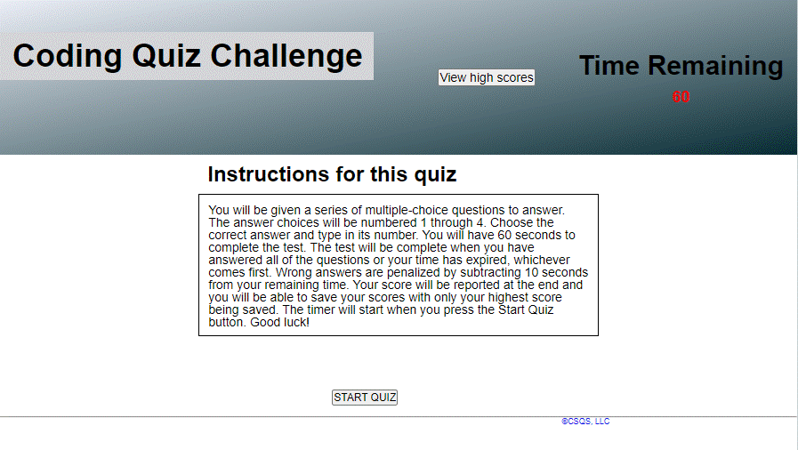

# JavascriptCodingTest
This application presents a coding quiz for topics in HTML, CSS, and JavaScript.
It is a timed test that pops up multiple-choice questions to simulate a coding
assessment as part of a job interview.  There is also a feature that keeps track
of the user's scores so that they can be viewed from the same screen.  The app
runs in the browser and it features dynamically updated HTML and CSS powered by
JavaScript.  It is responsive so that the usercan run it conveniently on a mobile device.


## User Story

```
This app can also be used by anyone who is working to improve their coding skills to take a timed quiz and keep track of their
high scores so that they can gauge their progress.
```

## Features
* To start the code quiz, the user will click the start button.
* A count-down timer starts and the user is presented with a question.
* When the user answers the question, if the answer is incorrect, then extra time is subtracted from the clock.
* If the answer is correct, then a point is added to the user's total.
* The user is presented with another question and the sequence is repeated.
* When all questions are answered or the timer reaches 0, then the game is over.
* When the game is over, the user can save their initials with their score.
* The user can view the list of high scores any time.


## Screenshot of the app



## Link to the published app:
https://CChampness.github.io/JavascriptCodingTest

